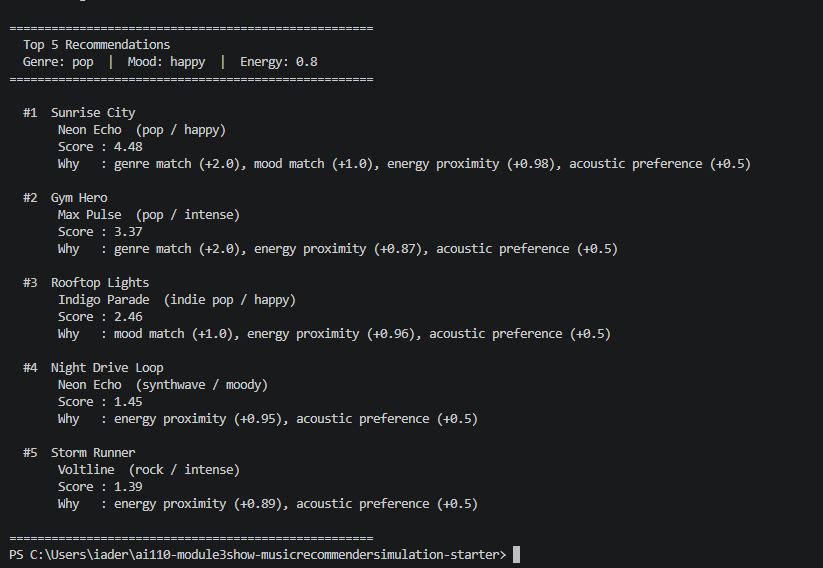
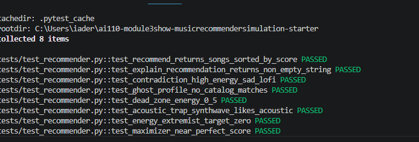

# 🎵 Music Recommender Simulation

## Project Summary

In this project you will build and explain a small music recommender system.

Your goal is to:

- Represent songs and a user "taste profile" as data
- Design a scoring rule that turns that data into recommendations
- Evaluate what your system gets right and wrong
- Reflect on how this mirrors real world AI recommenders

With a user's taste profile, the recommender scores every song in a 10 song catalog and returns the top results catered to the user's taste profile.
---

## How The System Works

Explain your design in plain language.

Some prompts to answer:

- What features does each `Song` use in your system
  - energy, tempo_bpm, valence, danceability, acousticness
- What information does your `UserProfile` store

User preferences such as favorite mood,genre, etc.

- How does your `Recommender` compute a score for each song

Categorical match — award points if song.genre == user.favorite_genre and song.mood == user.favorite_mood
Energy proximity — penalize based on abs(song.energy - user.target_energy)
Acoustic preference — award points if user.likes_acoustic and song.acousticness is high

- How do you choose which songs to recommend

Input
A UserProfile (genre, mood, target energy, acoustic preference)
A catalog of Song objects


### Sample Output



### Test Results



---

## Getting Started

### Setup

1. Create a virtual environment (optional but recommended):

   ```bash
   python -m venv .venv
   source .venv/bin/activate      # Mac or Linux
   .venv\Scripts\activate         # Windows

2. Install dependencies

```bash
pip install -r requirements.txt
```

3. Run the app:

```bash
python -m src.main
```

### Running Tests

Run the starter tests with:

```bash
pytest
```

You can add more tests in `tests/test_recommender.py`.

---

## Experiments You Tried

Use this section to document the experiments you ran. For example:

- What happened when you changed the weight on genre from 2.0 to 0.5

Mood becomes the dominant categorical signal and Energy proximity gains relative importance

- What happened when you added tempo or valence to the score

Same situation, no real big difference.

- How did your system behave for different types of users

Basically the same which is good for the scoring recipe.

---

## Limitations and Risks

Summarize some limitations of your recommender.

Examples:

-No fallback for missing genres
-Lofi catalog bias
-Energy dominates when genre/mood are absent
-No diversity enforcement
-No diversity enforcement
-No context awareness
---

## Reflection

Read and complete `model_card.md`:

[**Model Card**](model_card.md)

Write 1 to 2 paragraphs here about what you learned:

- about how recommenders turn data into predictions

The recommenders represent attributes that are measurable as features (ex:genre, energy, mood, acousticness). They also define a 
clear scoring function that maps the overlap between those user and item features. They then score the values accordingly and
explain where the ranks fit with the user's possible taste.

- about where bias or unfairness could show up in systems like this

Catalog bias can be a big factor where there is too much of one genre. This could lead to many genres/songs getting left behind in the 
predictor mix. Another could be the recommender judging based on geographic location, this could throw off one's engagement with the app
due to assumption based off surroundings.

---

## 7. `model_card_template.md`

Combines reflection and model card framing from the Module 3 guidance. :contentReference[oaicite:2]{index=2}  

```markdown
# 🎧 Model Card - Music Recommender Simulation

## 1. Model Name

Give your recommender a name

TuneMaster
---

## 2. Intended Use

- What is this system trying to do
- Who is it for

Music listeners that are trying to expand their musical horizon!

Example:

> This model suggests 3 to 5 songs from a small catalog based on a user's preferred genre, mood, and energy level. It is for classroom exploration only, not for real users.

---

## 3. How It Works (Short Explanation)

Describe your scoring logic in plain language.

- What features of each song does it consider
- What information about the user does it use
- How does it turn those into a number

Genre, mood, energy, acousticness is all things considered in scoring. The system takes all of these features into account
and grades it by points to see if a song matches the user's taste based on those features.

---

## 4. Data

Describe your dataset.

- How many songs are in `data/songs.csv`
- Did you add or remove any songs
- What kinds of genres or moods are represented
- Whose taste does this data mostly reflect

In `data/songs.csv`, there are 10 songs. No songs were added or removed from the original catalog.
Lofi takes 30% and Pop takes 20% of the catalog along with Rock, Ambient, Jazz, Synthwave and Indie pop taking the rest equally.
The catalog skews toward mid-tempo, electronically-influenced, low-stress listening.
---

## 5. Strengths

Where does your recommender work well

You can think about:
- Situations where the top results "felt right"
- Particular user profiles it served well
- Simplicity or transparency benefits

The recommender felt right when it ranked "Night Drive Loop" as #1 as it helped define the user's taste correctly in accordance with
the genre and mood. The system can be verified easily by a user to debug.
---

## 6. Limitations and Bias

Where does your recommender struggle

Some prompts:
- Does it ignore some genres or moods
- Does it treat all users as if they have the same taste shape
- Is it biased toward high energy or one genre by default
- How could this be unfair if used in a real product

Many genres are left out I noticed and it goes by a one-size-fits all taste shape.
It always goes by highest energy songs in the catalog. The unfairness yet again falls on the favoritism to a single genre.

---

## 7. Evaluation

How did you check your system

-Inspected the baseline profile by running the main script, performed recommender tests, and conducted weight shift experiments.

---

## 8. Future Work

If you had more time, how would you improve this recommender

-Could add tempo range
-Expand the data set and add a no match warning
-User feedback loop


---

## 9. Personal Reflection

A few sentences about what you learned:

- What surprised you about how your system behaved
- How did building this change how you think about real music recommenders
- Where do you think human judgment still matters, even if the model seems "smart"

-Im honestly surprised how well the scoring system worked.
Building this made me think about how I was introduced to new music through my use of spotify and how I can replicate that process
here. I still believe that human judgement will matter because models don't have the artistic and creative mindset humans possess.